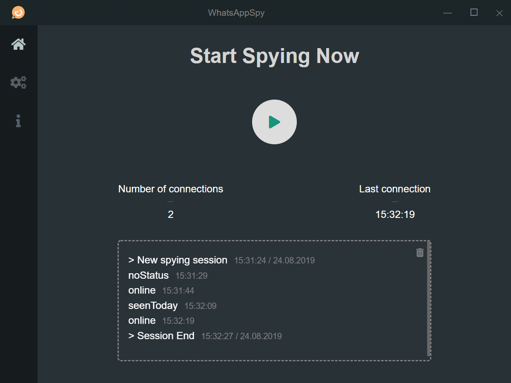
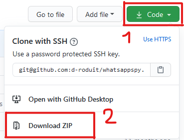

<h1 align="center">
   WhatsAppSpy
</h1>

    <strong>A cross-platform desktop application that allows you to spy on status changes of a WhatsApp contact</strong>

    

 

## Table of Contents

1. [Getting Started](#getting-started)
2. [Technologies](#technologies)
3. [Supported OS](#supported-os)
3. [Guides and resources](#guides-and-resources)
4. [Authors](#authors)
5. [License](#license)

## Getting Started

### 1. Download this program

Download this program by clicking first on the green "Code" button and then on the "Download ZIP" button of the dropdown. See the following example :

Once the ZIP file has been downloaded, you can unzip it wherever you want on your computer (on the Desktop for example) to be able to start the program in the following step.

### 2. Start the program

1. Open any terminal prompt (CMD, PowerShell, Terminal, Bash, ZSH, etc)
2. In your terminal, move into the unzipped folder (maybe named `whatsappspy-master`) by executing the following command `cd path/to/folder/whatsappspy-master`.
3. Execute the following command `npm install` to locally install all the necessary Node.js dependencies used by WhatsAppSpy. :warning: This step requires [Node.js](https://nodejs.org/en/) and NPM (bundled with Node.js starting from version 5.2+) to be installed on your machine.
4. Start WhatsAppSpy by executing `npm start`.

### 3. Configure the settings

Once WhatsAppSpy is running, the last thing to do before spying on your friend is to configure the settings in order for the program to work properly.

Configure the following settings :

#### Screenshots settings

| Setting | Description | Default&nbsp;value |
| ------------- | ------------- | :---------: |
| X&nbsp;coordinate | Sets the pixel on the horizontal axis from which the screenshot will be taken. | `null` |
| Y&nbsp;coordinate | Sets the pixel on the vertical axis from which the screenshot will be taken. | `null` |
| Screenshot&nbsp;width                               | The screenshot's width in pixel. | `10px` |
| Screenshot&nbsp;height | The screenshot's height in pixel. | `10px` |

To have the correct size and location settings, you must only see the "online" status text of the person and the top-left corner of the image must start at the top-left corner of the first letter.

The screenshot must be like the following one :

#### Application settings

| Setting | Description | Default&nbsp;value |
| ------------- | ------------- | :---------: |
| Data&nbsp;directory | The absolute path of the directory where the screenshots *(if enabled)* and the log file *(if enabled)* are going to be saved. | `" "` |
| Save&nbsp;the&nbsp;screenshots | If enabled, the screenshots the application makes in order to find if a person is online will be saved in a subfolder called "screenshots" in the data directory specified. | `false` |
| Write&nbsp;status&nbsp;changes&nbsp;in&nbsp;log&nbsp;file | If enabled, writes every new status change in a `log.txt` file. | `true` |
| Reset&nbsp;log&nbsp;file&nbsp;before&nbsp;starting&nbsp;a&nbsp;new&nbsp;spy&nbsp;session | If enabled, clears the log file content before every new spy session. | `false` |
| Send&nbsp;notifications&nbsp;when&nbsp;online | If enabled, the application will automatically push notifiation to your phone to alert you in real time of every new connection detected. This option requires a token, which one can be obtained by going to [https://whatsappspy.droduit.ch](https://whatsappspy.droduit.ch/). | `false` |
| Write&nbsp;status&nbsp;changes&nbsp;in&nbsp;log&nbsp;file | If enabled, writes every new status change in a log.txt file. | `true` |

#### Advanced settings

| Setting | Description | Default&nbsp;value |
| -------------------------- | ------------------| :---------------: |
| Color&nbsp;to&nbsp;identify&nbsp;the&nbsp;text | Sets the pixel color which will be used to determine if there's text or not. The greater the contrast between the status text color and its background, the more reliable the detection will be every time. |  `"#7c7c7c"` |

### 4. Start spying
You're all set to start spying on someone's connection ! :eyes:

Go to the home page and start now ! :clap:

## Technologies

The application is entirely written with web technologies (HTML, CSS, JavaScript) and is powered by the Electron framework.

It uses Sass instead of plain CSS to ease the development.

Moreover, it uses the following libraries to handle desktop screenshots and image manipulation:
- screenshot-desktop
- jimp

## Supported OS

* **MacOS** : 10.10 (Yosemite) or higher.
* **Windows** : Windows 7 or higher.
* **Linux** : Ubuntu 12.04, Fedora 21, Debian 8 and more.

## Guides and resources

* [Node.js](https://nodejs.org/) - Server runtime
* [Electron](https://www.electronjs.org/) - Framework for creating native applications with web technologies
* [jimp](https://github.com/oliver-moran/jimp) - Image processing library for Node written entirely in JavaScript
* [screenshot-desktop](https://github.com/bencevans/screenshot-desktop) - Library to capture screenshot of your local machine
* [Sass](https://sass-lang.com/) - CSS pre-processor

## Authors

<table>
   <tbody>
      <tr>
         <td align="center" valign="top" width="100%">
            <a href="https://github.com/d-roduit">
             
            Daniel Roduit
            </a>
         </td>
      </tr>
   </tbody>
</table>

## License

This project is licensed under the MIT License
